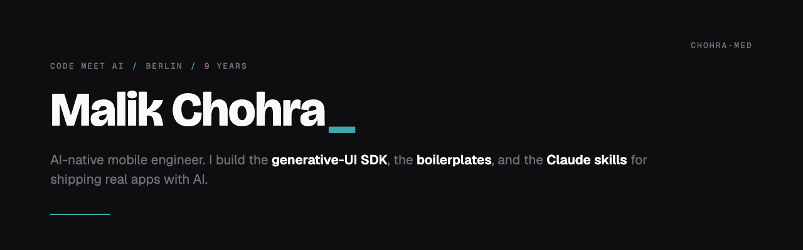

<picture>
  <source media="(prefers-color-scheme: dark)" srcset="assets/banner-dark.png">
  <source media="(prefers-color-scheme: light)" srcset="assets/banner-light.png">
  
</picture>

  

---

## About

Nine years shipping React Native and Expo apps, and for most of them I wanted tools that didn't exist yet. So now I build them. An SDK that lets an AI render real native UI instead of another chat bubble. Boilerplates that start where the boring setup ends. Claude skills that keep AI output on-brand instead of drifting to defaults.

I write about all of it in **[Code Meet AI](https://codemeetai.substack.com)**, receipts not hype. Berlin, open-source first.

## What I'm building

- **[Wire AI](https://getwireai.com)** is the open-source generative UI SDK for React Native. An LLM drives real native components at runtime, Zod-validated. No WebView, no HTML.
- **[AI Mobile Launcher](https://aimobilelauncher.com)** is a production Expo boilerplate: auth, payments, AI, and the Claude rules already wired, so you start at the interesting part.
- **Code Meet AI**, my weekly newsletter on shipping real products with AI. Receipts, not takes.
- **Colorway C**, the design system behind all of it, packaged so an AI can apply it directly.

## Open source

| Project | What it is |
|---|---|
| **[wireai-rn](https://github.com/chohra-med/wireai-rn)** | Generative UI SDK for React Native. Native components from LLM output, Zod-validated. |
| **[expo_boilerplate](https://github.com/chohra-med/expo_boilerplate)** | AI-first Expo starter. Feature-first, TypeScript, auth, i18n, theming, Cursor + Claude rules. |
| **[mcp-for-your-app](https://github.com/chohra-med/mcp-for-your-app)** | A guide + two Claude skills: audit whether an AI can see your app's funnel, then build the MCP that makes it reachable. |
| **[claude_design_skill](https://github.com/chohra-med/claude_design_skill)** | A Claude skill that front-loads design tokens so AI-generated UI stays on-brand, then verifies it. |
| **[colorway-c-brand](https://github.com/chohra-med/colorway-c-brand)** | The Colorway C design system as an agent-readable skill: palette, type, motion, rules. |

 

  

**Building something with AI on mobile?** Read the newsletter, or open an issue on any repo. I read everything.

[**codemeetai.substack.com**](https://codemeetai.substack.com)

